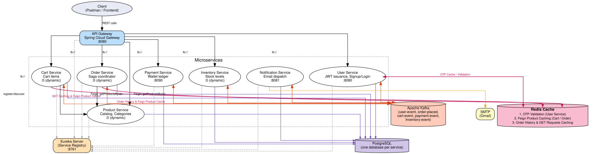
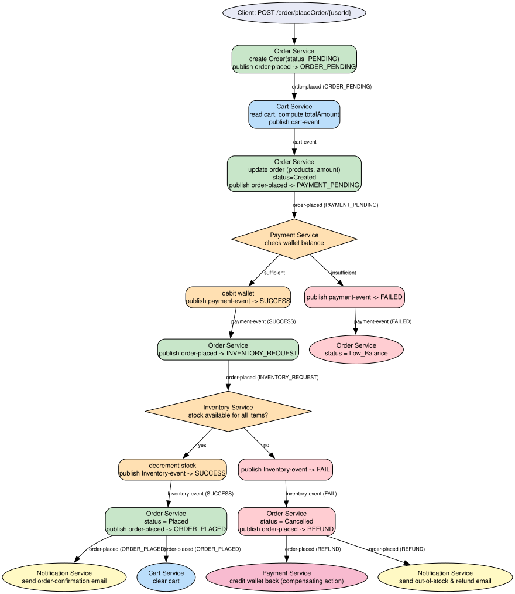
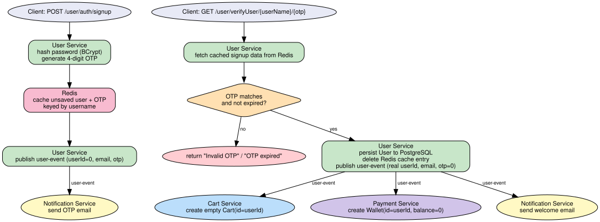

# 🛒 Scalable E-Commerce Microservices Platform

An event-driven microservices backend for an e-commerce system, built with **Spring Boot 4 / Spring Cloud 2025.1**, **Apache Kafka**, **Redis**, **PostgreSQL**, **Eureka** and **Spring Cloud Gateway**.
Project reference:
https://roadmap.sh/projects/scalable-ecommerce-platform

Order placement is implemented as a **Kafka-based choreography saga** — Order, Payment and Inventory services react to each other's events with no central orchestrator, and the flow rolls back (refund) if a step fails downstream.

---

## Table of Contents
- [Architecture](#architecture)
- [Order Placement Flow (Saga)](#order-placement-flow-saga)
- [User Signup / OTP Verification Flow](#user-signup--otp-verification-flow)
- [Kafka Topics](#kafka-topics)
- [Services](#services)
- [Tech Stack](#tech-stack)
- [API Reference](#api-reference)
- [Running Locally](#running-locally)
- [Configuration](#configuration)

---

## Architecture



- **Dynamic ports (`server.port=0`)** on Cart/Order/Product/Inventory services → each can run multiple instances registered under the same Eureka app-id, so the Gateway's `lb://` routes load-balance across them.
- **OpenFeign** is used for synchronous, low-latency reads (Cart/Order → Product, "give me these product IDs' details").
- **Kafka** is used for everything that changes state across services (signup, order lifecycle) — this makes the order flow a **saga** instead of a chain of blocking REST calls.

---

## Order Placement Flow (Saga)

A choreographed saga across Order, Cart, Payment and Inventory services, all communicating over Kafka. No service calls another service's REST API to place an order; every step reacts to an event.



If inventory reservation fails after payment already succeeded, the system publishes `REFUND` and Payment Service credits the money back — a compensating transaction, since there's no 2PC across the three separate databases.

---

## User Signup / OTP Verification Flow



The user row is only written to Postgres **after** OTP verification — signup doesn't create an unverified account in the database, it parks the pending signup in Redis until the OTP is confirmed.

---

## Kafka Topics

| Topic | Producer(s) | Consumer(s) | Purpose |
|---|---|---|---|
| `user-event` | User Service | Cart, Payment, Notification | Fan-out on signup: create cart, create wallet, send OTP/welcome email |
| `order-placed` | Order Service (multi-stage) | Cart, Payment, Inventory, Notification | Multiplexed saga channel — an `EventType` enum (`ORDER_PENDING`, `PAYMENT_PENDING`, `INVENTORY_REQUEST`, `ORDER_PLACED`, `REFUND`, `ORDER_STATUS_UPDATED`) tells each consumer which branch to run |
| `cart-event` | Cart Service | Order Service | Cart snapshot (products + computed total) sent back to Order after `ORDER_PENDING` |
| `payment-event` | Payment Service | Order Service | Payment success/failure result |
| `Inventory-event` | Inventory Service | Order Service | Stock reservation success/failure result |

All Kafka connections use SSL client-cert auth (PKCS12 keystore + JKS truststore) against a managed Aiven Kafka cluster.

---

## Services

| Service | Port | Datastore | Responsibility |
|---|---|---|---|
| **Service Registry** | `8761` | – | Eureka server for service discovery |
| **API Gateway** | `8080` | – | Spring Cloud Gateway — routes `/api/v1/**` to the right service via `lb://` |
| **User Service** | `8087` | `user-db` + Redis | Signup, OTP verification, login (JWT issuance), profile CRUD |
| **Product Service** | `8081`| `product-db` | Product catalog, category browsing, pagination, bulk product lookup for Cart/Order |
| **Cart Service** | `8083` | `cart-db` | Add/update/fetch cart items, builds order snapshot, clears cart post-order |
| **Order Service** | `8082` | `order-db` | Orchestrates the saga, order history, order status/detail lookup |
| **Payment Service** | `8084` | `payment-db` | Internal wallet ledger — top-up, debit on payment, credit on refund |
| **Inventory Service** | `8085` | `inventory-db` | Stock levels per product, decrement on order, restock endpoint |
| **Notification Service** | `8086` | `notification-db` | Consumes user/order events, sends transactional emails via SMTP |

---

## Tech Stack

- **Language / Runtime:** Java 21
- **Framework:** Spring Boot 4.0.7, Spring Cloud 2025.1.2
- **Service Discovery:** Netflix Eureka
- **API Gateway:** Spring Cloud Gateway (WebMVC)
- **Inter-service sync calls:** OpenFeign
- **Messaging / Saga:** Apache Kafka (Spring Kafka), SSL-secured
- **Databases:** PostgreSQL (one schema per service — database-per-service pattern)
- **Cache:** Redis — short-lived OTP storage
- **Auth:** Spring Security + BCrypt password hashing + JJWT (JWT issuance)
- **Email:** Spring Mail / SMTP
- **Build:** Maven (independent multi-module — no parent aggregator POM; each service builds standalone)
- **Boilerplate reduction:** Lombok

---

## API Reference

All routes below are exposed through the Gateway at `http://localhost:8080`.

**User Service** — `/api/v1/user`
```
POST   /api/v1/user/auth/signup
POST   /api/v1/user/auth/login
GET    /api/v1/user/auth/health
GET    /api/v1/user/verifyUser/{userName}/{otp}
GET    /api/v1/user/users/{userName}
PUT    /api/v1/user/users/{userName}
```

**Product Service** — `/api/v1/products`
```
GET    /api/v1/products/{id}
POST   /api/v1/products
POST   /api/v1/products/saveAll
POST   /api/v1/products/getProducts          # bulk lookup by IDs (used by Cart/Order via Feign)
GET    /api/v1/products/category/{category}/{page}
GET    /api/v1/products/all/{page}/{size}
```

**Cart Service** — `/api/v1/cart`
```
POST   /api/v1/cart/addProduct
PUT    /api/v1/cart/updateProduct
POST   /api/v1/cart/getCart
```

**Order Service** — `/api/v1/order`
```
POST   /api/v1/order/placeOrder/
GET    /api/v1/order/orderHistory/
PATCH  /api/v1/order/updateOrderStatus/{orderId}/{status}
GET    /api/v1/order/getOrderDetails/{orderId}
```

**Payment Service** — `/api/v1/wallets`, `/api/v1/payments`
```
POST   /api/v1/wallets
POST   /api/v1/wallets/{userId}/top-up
GET    /api/v1/wallets/{userId}
GET    /api/v1/payments/{userId}
```

**Inventory Service** — `/api/v1/stocks`
```
POST   /api/v1/stocks               # increase stock
```

---

## Running Locally

1. **Provision infra:** a PostgreSQL instance (one DB per service — `user-db`, `product-db`, `cart-db`, `order-db`, `payment-db`, `inventory-db`, `notification-db`), a Kafka broker (SSL-enabled if you keep the current config), and a Redis instance.

2. **Start in this order** (Eureka and the Gateway first; the rest are event-driven and can start in any order):

Prerequisites:

- Docker & Docker Compose installed and running.
- PostgreSQL, Redis and (optionally) a Kafka broker available for the services (see Configuration section).

Quick Docker Compose quick-start (recommended):

- Clone the repo if you haven't already:

```
git clone https://github.com/jhanishant658/springboot-ecommerce-microservices.git
cd springboot-ecommerce-microservices
```

- Build images (one-time or after code changes):

```
docker compose build
```

- Start only Service Registry (Eureka) and the API Gateway first:

```
docker compose up -d service-registry gateWay
```

Wait for Eureka to be healthy and for the Gateway to start. Verify registration at `http://localhost:8761` and the gateway at `http://localhost:8080`.

- Then start the remaining services (all at once):

```
docker compose up -d
```

Or start individual services if you prefer (replace names with the service compose service names):

```
docker compose up -d UserService Product-Service CartService OrderService PaymentService InventoryService NotificationService
```

- To rebuild images and restart (useful after code changes):

```
docker compose up -d --build
```

Alternative: run a single service locally (Maven) for development:

```
cd UserService
./mvnw spring-boot:run
```

Tips & troubleshooting:

- If a service uses `server.port=0` it registers with Eureka on a dynamic port — the Gateway routes to it via service id (no port needed).
- Check logs while starting: `docker compose logs -f <service-name>`.
- If services fail to register, confirm DB/Kafka/Redis env vars and network connectivity.
- Use `docker compose ps` to view running containers and ports.

This sequence ensures Eureka has the registry available before other services attempt to register, and the Gateway can route traffic once services are up.
3. **Check registration:** Eureka dashboard → `http://localhost:8761`
4. **Hit the API:** through the gateway → `http://localhost:8080`

Each module is an independent Maven project (no root aggregator `pom.xml`), so you can also open/build/run each folder individually in your IDE.

---

## Configuration

Each service reads its DB/Kafka/Redis/SMTP connection details from `application.properties`. For any environment beyond local experimentation, override these via environment variables instead of committing literal values, e.g.:

```properties
spring.datasource.url=${DB_URL}
spring.datasource.username=${DB_USERNAME}
spring.datasource.password=${DB_PASSWORD}
spring.kafka.bootstrap-servers=${KAFKA_BOOTSTRAP_SERVERS}
spring.data.redis.password=${REDIS_PASSWORD}
spring.mail.password=${MAIL_PASSWORD}
jwt.secret=${JWT_SECRET}
```